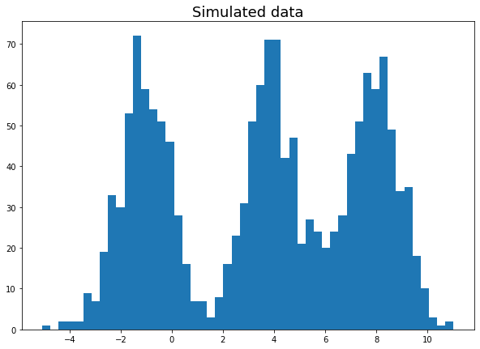
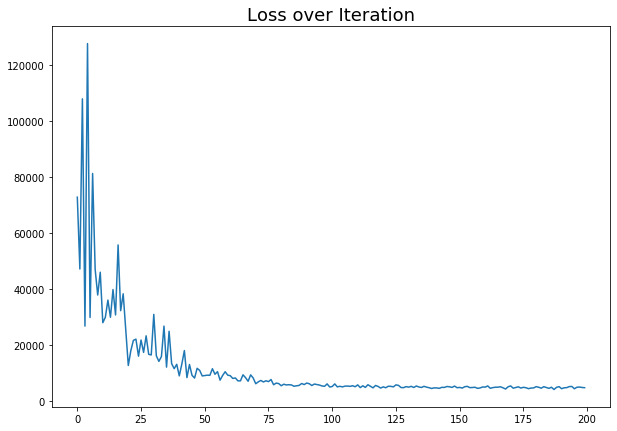
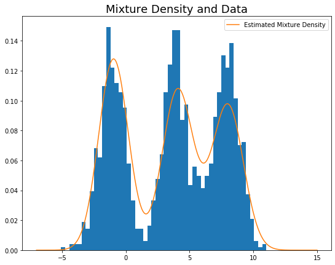
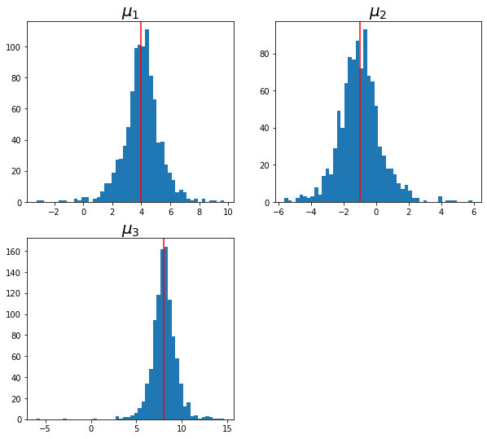
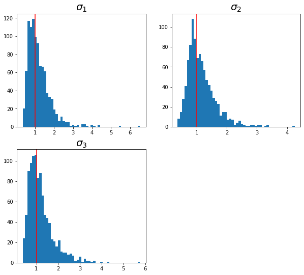

# Assignment Outline

In this assignment, we use truncated stick-breaking representation of dirichlet process mixture model (DPMM) to model synthetic generated data.
Variational inference (VI) technique is used to approximate the posterior distribution of DPMM.
Since VI cast an inference problem into an optimization problem, we leverage **Pyro** for this assignment.
**Pyro** was chosen as it is built on top of **PyTorch**'s optimization library which is a commonly used library in machine learning community. 

This assignment also showcases marginalization of discrete random variable for variance reduce on gradient to provide stable training.
In addition, this assignment also provide a way to check for the posterior distribution in **Pyro**.

Some software requirement:  

- **Pyro** version 1.3.1
- **PyTorch** version 1.5
- Python version 3.7

## Problem Statement

Let $G_0$ be Normal Inverse-Gamma with $\lla_0 = (\mu_0, \alpha_0, \beta_0)$ as hyper-parameter,

\begin{align}
G_0(\pph \mid \lla_0) = \N \left( \mu \mid \mu_0, \sigma^2 \right) \mbox{Inv-Gamma}\left( \sigma^2 \mid \alpha_0, \beta_0\right), 
\end{align}
where $\pph = (\mu, \sigma)$.
$G_0$ is the base measure of our DPMM.

Now, let $\alpha_b > 0$ be the concentration parameter, then we construct DPMM through the stick breaking process as follows: 

1. Draw $\pph_1, \pph_2, \ldots \iid G_0(\pph)$, where $\pph_i = (\mu_i, \sigma_i)$.
2. Draw $\beta_1, \beta_2, \ldots \iid \mbox{Beta}(1,\alpha_b)$ and let $w_k = \beta_k \prod_{i=1}^{k-1}(1-\beta_i)$.
3. For the $n$-th data point $x_n$:  
    - Draw cluster membership $z_n \sim \mbox{Cat}(\ww)$.
    - Draw $x_n \mid z_n = k \sim \N(\mu_k, \sigma_k)$.
    
Note for simplicity, we let $T$ be a truncation value.
The generative process is coded in Pyro as such^[Although the formulation is presented for data in $\mathbb{R}^1$, the code is written in such a way that it is ready for use with higher dimension.]:
```{python, eval=F}
def model(self, data, batch_idx):
    # The beta's are conditionally independent.
    with pyro.plate("beta_plate", self.T - 1):
        beta = pyro.sample("beta", dist.Beta(1, self.alpha))

    # The components are conditionally independent.
    # to_event(1) indicates the second dimension of the tensor are dependent.
    with pyro.plate("mu_plate", self.T):
        mu_sd = pyro.sample("musd", dist.InverseGamma(torch.ones_like(self.sd_q1),
                                                      torch.ones_like(self.sd_q2)).to_event(1))
        mu_c = pyro.sample("mu", dist.Normal(self.mu_c,
                                             mu_sd*torch.ones_like(self.mu_c)).to_event(1))

    # The data is conditionally independent.
    with pyro.plate("data", size=self.num_obs, subsample=batch_idx):
        ys = pyro.sample("cat", dist.Categorical(mix_weights(beta)), infer={"enumerate": "parallel"})
        pyro.sample("obs", dist.Normal(mu_c[ys], mu_sd[ys]).to_event(1), obs=data[batch_idx])


```

The corresponding joint probability distribution from generative model is
\begin{align}
p(\xx, \zz, \bbe, \pph) = p(\xx \mid \zz)p(\bbe)G_0(\pph \mid \lla_0) (\#eq:joint-dpmm)
\end{align}

In this assignment, we approximate the posterior of \@ref(eq:joint-dpmm) with variational inference.
We assume a fully factorized variational distribution as such,
\begin{align}
q(\bbe, \pph, \zz) = \prod_{i=1}^{T-1} q(\beta_i) \prod_{i=1}^{T} q(\phi_i) \prod_{n=1}^{N} q(z_n) (\#eq:vi-dpmm)
\end{align}

The various variational distributions are,
\begin{align}
q(\beta_i) &= \mbox{Beta}(1, \eta_i) \\
q(\phi_i) &= \N \left( \mu_i \mid m_i, s_i^2 \right) \mbox{Inv-Gamma}\left( s_i^2 \mid a_i, b_i\right) \\
q(z_n) &= \mbox{Categorical}(\rho_n), \mbox{ where } \rho_n \in \mathbb{R}^T
\end{align}
where $\pps = (\eta_i, m_i, a_i, b_i, \pi_i)$ are the variational parameters.

We approximate \@ref(eq:joint-dpmm) with \@ref(eq:vi-dpmm) through the evidence lower bound (ELBO)^[Refer to variational chapter for derivation],
\begin{align}
\log p(\xx) &\geq \E_{q(\bbe, \pph, \rrh \mid \xx)} \left( \log \frac{p(\xx, \rrh, \bbe, \pph)}{q(\bbe, \pph, \rrh \mid \xx)} \right)  (\#eq:dpmm-elbo) \\
&= \L_{ELBO}(x)
\end{align}

In Pyro, the variational distribution (called _guide_) is written as, 
```{python, eval=F}
def guide(self, data, batch_idx):

    # Define all the variational parameters
    alpha_q = pyro.param('alpha_q', self.alpha_q, constraint=constraints.positive)
    rho = pyro.param('rho', self.rho, constraint=constraints.simplex)
    mu_q = pyro.param("mu_q", self.mu_c)
    sd_q1 = pyro.param('sd_q1', self.sd_q1)
    sd_q2 = pyro.param('sd_q2', self.sd_q2)

    with pyro.plate("beta_plate", self.T - 1):
        f_beta = pyro.sample("beta", dist.Beta(torch.ones(self.T - 1), alpha_q))

    with pyro.plate("mu_plate", self.T):
        mu_sd = pyro.sample("musd", dist.InverseGamma(sd_q1, sd_q2).to_event(1))
        mu_c = pyro.sample("mu", dist.Normal(mu_q, mu_sd).to_event(1))

    with pyro.plate("data", size=self.num_obs, subsample=batch_idx):
        f_cat = pyro.sample("cat", dist.Categorical(rho[batch_idx]))

```


## Variational Inference

Variational inference casts an inference problem into an optimization problem by maximizing $\L_{ELBO}(x)$ in \@ref(eq:dpmm-elbo).

Pyro takes gradient of $\L_{ELBO}(x)$ with respect to the variational parameters $\pps$, i.e. $\nabla_{\pps} \L_{ELBO}(x)$. The gradient is taken with automatic differentiation algorithm [@wingate2013automated].

Notice that in our model, discrete random variables ($z_n$'s in our case) are latent, hence Pyro would sample the $z_n$ and so leading to high-variance gradient estimates. 
We sum out the $z_n$ to mitigate the problem of high-variance gradient estimate.
This can be done in Pyro using `config_enumerate`. 
Setting it up:

```{python, eval=F}
optimizer = torch.optim.Adam
scheduler = PyroLRScheduler(StepLR, {'optimizer': optimizer,
                                     'optim_args': {'lr': 0.05, 'betas':[0.9,0.95]},
                                     'gamma': 0.5, "step_size": 100},{"clip_norm": 1.})

basic_svi = SVI(config_enumerate(model.model), config_enumerate(model.guide), scheduler, 
                loss=TraceEnum_ELBO(max_plate_nesting=1))
```

### Data simulation for inference

The section shows that data simulated for inference.

```{r sim-data, echo=F, fig.align='center', fig.cap="Data Simulated from three Normal distribution."}

```

For this assignment, we generate data from three distince one-dimensional Normal distribution as seen in Figure \@ref(fig:sim-data).
The data is generated from:  

1. $\N(\mu_1,\sigma_1), \mu_1 = -1, \sigma_1=1$
2. $\N(\mu_2,\sigma_2), \mu_2 = 4, \sigma_2=1$
3. $\N(\mu_3,\sigma_3), \mu_3 = 8, \sigma_3=1$

### Optimization

Training steps with Pyro's optimizer:

```{python, eval=F}
# Define data sub-samples for training
split_idx = torch.arange(0,x_data.size(0),batch_size)
rand_idx = torch.randperm(x_data.size(0))
for it in range(n_epoch):
    for ii in range(split_idx.size(0)-1):  # Loop through dataset for inference
        start_idx = split_idx[ii]
        end_idx = split_idx[ii+1]
        loss = basic_svi.step(x_data, rand_idx[start_idx:end_idx])  # Take gradient step
        losses.append(loss)
```

The loss progression can be seen in Figure \@ref(fig:loss-plot).

```{r loss-plot, echo=F, fig.align='center', fig.cap="Loss over iterations."}

```
Notice even with `config_enumerate` we still yield high loss value in the first few iterations.
Sometimes in practice, the loss value can be so high that we could not train the model.

### Posterior Predictive Checks

The loss seems to decrease over iterations and converge. 
However, variational inference can be stuck at a bad minima. 
Thus, we do posterior predictive check using Pyro's `Predictive` function. 
This function first samples all latent variables from the trained _guide_; then using these samples to create a conditioned model and then sample from the conditioned model.
In short, this function allows us to sample from $p(x_{new} \mid \xx)$.

```{python, eval=F}
predictive = Predictive(model.model, guide=model.guide, num_samples=1000)
svi_samples = {key: value.detach().cpu() for key, value in predictive(x_data, torch.arange(x_data.size(0))).items()}
```
The `svi_samples` contains $1000$ samples from each latent variables (sampled from variational distribution). 
We then take the mean of those samples and plot the estimated density of the data:
```{r, echo=F, fig.align='center', fig.cap="Estimated posterior density."}

```

We can also examine the posterior distribution of each parameter.
```{r, echo=F, fig.align='center', fig.cap="Posterior distribution of $\\mu$'s."}

```
The vertical indicates the true $\mu$ which were used to generate the data, and the histograms are samples from variational distribution.

Similarly, for the variances
```{r, echo=F, fig.align='center', fig.cap="Posterior distribution of $\\sigma$."}

```
The vertical indicates the true $\sigma$ which were used to generate the data, and the histograms are samples from variational distribution.

